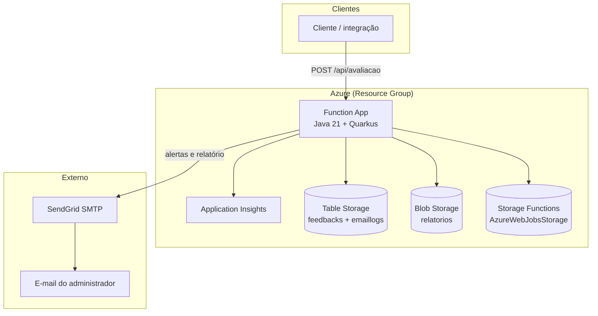
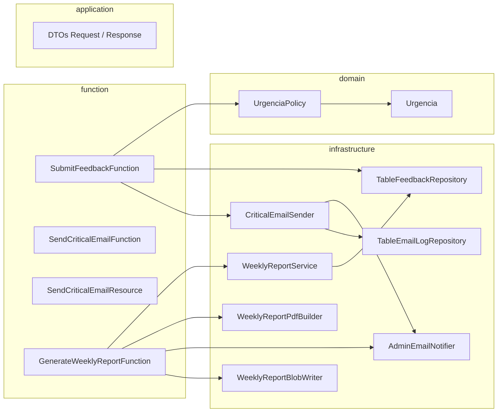
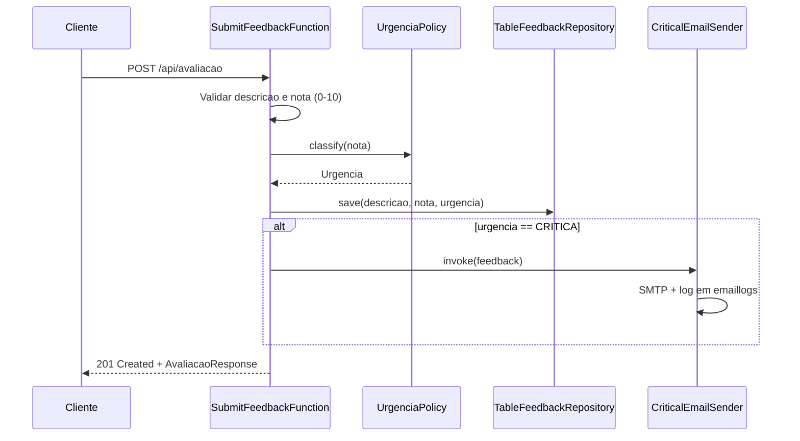
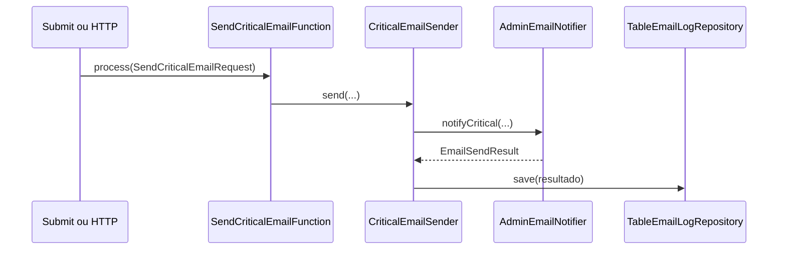
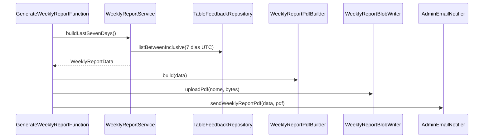
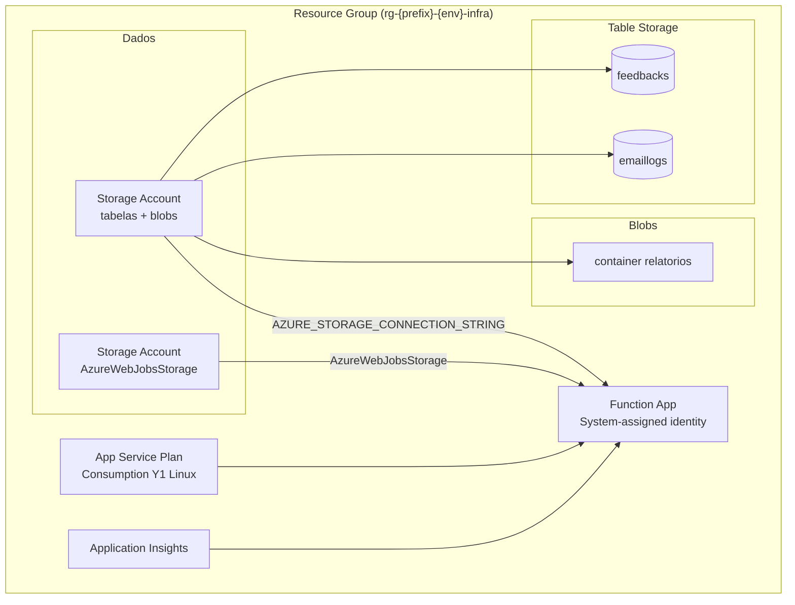
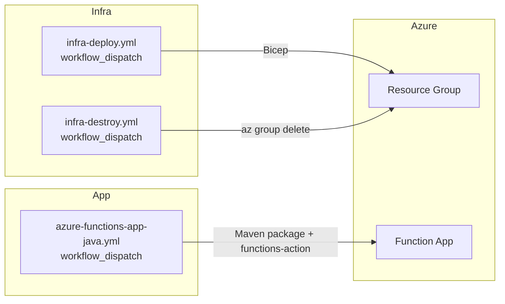

# Sistema de Feedback — TC-4

API serverless para receber avaliações de clientes, classificar urgência, notificar administradores em casos críticos e gerar relatório semanal automatizado. A aplicação roda em **Azure Functions** (Java 21) com **Quarkus**, persiste dados em **Azure Table Storage** e **Blob Storage**, e envia e-mails via **SendGrid SMTP**.

---

## Sumário

- [Visão geral](#visão-geral)
- [Arquitetura](#arquitetura)
- [Estrutura do projeto](#estrutura-do-projeto)
- [Funcionalidades](#funcionalidades)
- [API HTTP](#api-http)
- [Modelo de dados](#modelo-de-dados)
- [Classificação de urgência](#classificação-de-urgência)
- [Infraestrutura Azure](#infraestrutura-azure)
- [Variáveis de ambiente](#variáveis-de-ambiente)
- [Pré-requisitos](#pré-requisitos)
- [Execução local](#execução-local)
- [Deploy](#deploy)
- [CI/CD](#cicd)
- [Stack tecnológica](#stack-tecnológica)

---

## Visão geral

O sistema expõe um endpoint para submissão de feedbacks (`POST /api/avaliacao`). Cada avaliação recebe uma nota de 0 a 10 e uma descrição textual. Com base na nota, o domínio classifica a urgência em três níveis: **CRITICA**, **ATENCAO** ou **OK**.

Quando a urgência é **CRITICA**, um e-mail de alerta é enviado ao administrador e o resultado do envio é registrado na tabela `emaillogs`. Toda segunda-feira às 09:00 UTC, um timer dispara a geração do relatório semanal: agrega os feedbacks dos últimos 7 dias, produz um PDF, envia por e-mail ao admin e armazena uma cópia no container Blob `relatorios`.



---

## Arquitetura

A aplicação segue separação em camadas dentro do pacote `br.com.fiap.tc.feedback`:

| Camada | Responsabilidade |
|--------|------------------|
| **function** | Triggers Azure Functions (HTTP, Timer) e recursos JAX-RS expostos pelo Quarkus |
| **application** | DTOs de entrada e saída da API |
| **domain** | Regras de negócio puras (enum `Urgencia`, `UrgenciaPolicy`) |
| **infrastructure** | Integrações: Table Storage, Blob, SMTP, geração de PDF |



### Runtime híbrido Quarkus + Azure Functions

- Endpoints REST (`/api/avaliacao`, `/api/send-critical-email`) são servidos pelo **Quarkus HTTP** (`quarkus.http.root-path=/api`).
- A function `sendCriticalEmail` permanece registrada como trigger HTTP Azure para testes no portal; a submissão de feedback invoca a mesma lógica via **CDI** (`CriticalEmailFunctionClient`), sem chamada HTTP interna.
- O relatório semanal usa trigger **Timer** nativo (`0 0 9 * * MON`).

---

## Estrutura do projeto

```
feedback/
├── .github/workflows/          # Pipelines GitHub Actions
│   ├── infra-deploy.yml        # Provisiona RG + Bicep
│   ├── infra-destroy.yml       # Remove Resource Group
│   └── azure-functions-app-java.yml  # Build Maven + deploy Function App
├── infra/
│   └── main.bicep              # Infraestrutura como código
├── src/main/java/br/com/fiap/tc/feedback/
│   ├── application/dto/        # Contratos da API
│   ├── domain/                 # Modelo e políticas
│   ├── function/
│   │   ├── http/               # Submit + resource crítico
│   │   ├── email/              # Function sendCriticalEmail
│   │   └── timer/              # Function generateWeeklyReport
│   └── infrastructure/
│       ├── database/           # Repositórios Table Storage
│       ├── email/              # SMTP SendGrid + orquestração
│       └── report/             # Agregação, PDF e Blob
├── src/main/resources/
│   └── application.properties
├── host.json                   # Configuração Azure Functions host
├── local.settings.json         # Variáveis locais (não versionar segredos)
├── pom.xml
└── .env.example                # Referência de variáveis para desenvolvimento
```

---

## Funcionalidades

### 1. Submissão de avaliação



### 2. Alerta de feedback crítico

Disparado automaticamente após salvar um feedback com urgência **CRITICA**. Também disponível via `POST /api/send-critical-email` (Quarkus ou Azure Function).



Se `SENDGRID_API_KEY`, `NOTIFY_FROM_EMAIL` ou `ADMIN_NOTIFY_EMAIL` não estiverem configurados, o envio entra em modo **SIMULATED** (log de aviso, sem e-mail real).

### 3. Relatório semanal



O PDF contém: média das notas, quantidade por dia, quantidade por urgência e detalhamento de cada avaliação (descrição, urgência, data de envio).

---

## API HTTP

Base URL em produção: `https://{function-app-name}.azurewebsites.net/api`

| Método | Rota | Descrição |
|--------|------|-----------|
| `POST` | `/avaliacao` | Cria uma avaliação |
| `POST` | `/send-critical-email` | Envia alerta crítico (uso manual ou testes) |

### POST /api/avaliacao

**Request**

```json
{
  "descricao": "Produto chegou com defeito",
  "nota": 2
}
```

**Response** `201 Created`

```json
{
  "id": "uuid",
  "descricao": "Produto chegou com defeito",
  "nota": 2,
  "urgencia": "CRITICA",
  "dataEnvioUtc": "2026-05-19T12:00:00Z"
}
```

**Erros**

| Status | Condição |
|--------|----------|
| `400` | `descricao` ausente ou vazia; `nota` fora do intervalo 0–10 |
| `500` | Falha ao persistir ou erro interno |

### POST /api/send-critical-email

**Request**

```json
{
  "feedbackId": "uuid",
  "descricao": "texto",
  "urgencia": "CRITICA",
  "feedbackCreatedAt": "2026-05-19T12:00:00Z"
}
```

**Response** `202 Accepted` com corpo `accepted`.

---

## Modelo de dados

### Tabela `feedbacks`

| Campo | Tipo | Descrição |
|-------|------|-----------|
| `PartitionKey` | string | Dia UTC (`yyyy-MM-dd`) |
| `RowKey` | string | UUID do feedback |
| `descricao` | string | Texto da avaliação |
| `nota` | int | Nota de 0 a 10 |
| `urgencia` | string | `CRITICA`, `ATENCAO` ou `OK` |
| `createdAt` | string | ISO-8601 UTC |

### Tabela `emaillogs`

| Campo | Tipo | Descrição |
|-------|------|-----------|
| `PartitionKey` | string | Dia UTC do log |
| `RowKey` | string | UUID do log |
| `feedbackId` | string | ID do feedback relacionado |
| `descricao` | string | Cópia da descrição |
| `urgencia` | string | Urgência no momento do envio |
| `feedbackCreatedAt` | string | Data original do feedback |
| `mode` | string | `SENT`, `SIMULATED` ou `SMTP_FAILED` |
| `statusCode` | int? | Código SMTP quando aplicável |
| `errorDetail` | string? | Detalhe de erro ou partes ausentes |
| `fromEmail` / `toEmail` | string? | Remetente e destinatário |
| `loggedAt` | string | ISO-8601 UTC |

### Blob `relatorios`

Arquivos PDF nomeados como `relatorio-semana-{inicio}-a-{fim}.pdf`.

---

## Classificação de urgência

| Nota | Urgência |
|------|----------|
| 0 – 3 | `CRITICA` |
| 4 – 6 | `ATENCAO` |
| 7 – 10 | `OK` |

Apenas feedbacks **CRITICA** disparam o fluxo de e-mail imediato.

---

## Infraestrutura Azure

O template `infra/main.bicep` provisiona, dentro de um Resource Group:



### Recursos criados

| Recurso | Nome padrão | Função |
|---------|-------------|--------|
| Storage (dados) | `{prefix}{env}tblstg` | Tabelas `feedbacks`, `emaillogs` e container `relatorios` |
| Storage (runtime) | `{prefix}{env}fnstg` | Estado interno do Azure Functions |
| Application Insights | `{prefix}-appi` | Telemetria e logs |
| App Service Plan | `{prefix}-plan` | Plano Consumption Linux |
| Function App | `tc4fb-func` (configurável) | Hospeda a aplicação Java 21 |

### App Settings provisionadas pelo Bicep

| Variável | Origem |
|----------|--------|
| `AZURE_STORAGE_CONNECTION_STRING` | Storage de dados |
| `FEEDBACK_TABLE_NAME` | Parâmetro (default: `feedbacks`) |
| `EMAIL_LOG_TABLE_NAME` | Default: `emaillogs` |
| `WEEKLY_REPORT_CONTAINER` | Default: `relatorios` |
| `AZURE_HTTP_TIMEOUT_SECONDS` | Parâmetro (default: `10`) |
| `APPLICATIONINSIGHTS_*` | Application Insights |

As credenciais SendGrid (`SENDGRID_API_KEY`, `NOTIFY_FROM_EMAIL`, `ADMIN_NOTIFY_EMAIL`) são configuradas no deploy da aplicação via GitHub Actions ou manualmente no portal Azure.

### Parâmetros do Bicep

| Parâmetro | Default | Descrição |
|-----------|---------|-----------|
| `prefix` | — | Prefixo dos nomes (ex.: `tc4fb`) |
| `envName` | `demo` | Ambiente (`demo`, `dev`, `prod`) |
| `location` | RG location | Região Azure |
| `feedbackTableName` | `feedbacks` | Nome da tabela de feedbacks |
| `functionAppBaseName` | `{prefix}-func` | Nome base da Function App |
| `functionAppUseUniqueSuffix` | `false` | Sufixo único no nome global |

---

## Variáveis de ambiente

| Variável | Obrigatória | Descrição |
|----------|-------------|-----------|
| `AZURE_STORAGE_CONNECTION_STRING` | Sim | Connection string do storage de dados |
| `FEEDBACK_TABLE_NAME` | Não | Default: `feedbacks` |
| `EMAIL_LOG_TABLE_NAME` | Não | Default: `emaillogs` |
| `WEEKLY_REPORT_CONTAINER` | Não | Default: `relatorios` |
| `AZURE_HTTP_TIMEOUT_SECONDS` | Não | Timeout SDK Azure (default: `10`) |
| `SENDGRID_API_KEY` | Para e-mail real | API key SendGrid |
| `NOTIFY_FROM_EMAIL` | Para e-mail real | Remetente verificado no SendGrid |
| `ADMIN_NOTIFY_EMAIL` | Para e-mail real | Destinatário dos alertas e relatórios |
| `SMTP_HOST` | Não | Default: `smtp.sendgrid.net` |
| `SMTP_PORT` | Não | Default: `587` |
| `SMTP_USERNAME` | Não | Default: `apikey` |

Consulte `.env.example` e `local.settings.json` como referência para desenvolvimento local.

---

## Pré-requisitos

- **JDK 21** (Zulu ou equivalente)
- **Maven 3.9+**
- **Azure CLI** (para deploy manual)
- Conta **Azure** com permissões para criar Resource Groups
- Conta **SendGrid** com remetente verificado (para envio real de e-mails)
- **GitHub** com environment `Actions` e secrets OIDC:
  - `AZURE_CLIENT_ID`
  - `AZURE_TENANT_ID`
  - `AZURE_SUBSCRIPTION_ID`
  - `SENDGRID_API_KEY`
  - `NOTIFY_FROM_EMAIL`
  - `ADMIN_NOTIFY_EMAIL`

---

## Execução local

1. Configure `local.settings.json` ou exporte as variáveis de `.env.example`.
2. Para storage local, use [Azurite](https://learn.microsoft.com/azure/storage/common/storage-use-azurite) e a connection string padrão do emulador.
3. Build e execução:

```bash
mvn quarkus:dev
```

4. Teste a API:

```bash
curl -X POST http://localhost:7071/api/avaliacao \
  -H "Content-Type: application/json" \
  -d "{\"descricao\":\"Teste local\",\"nota\":2}"
```

Para empacotar como Azure Functions:

```bash
mvn -B package -Dquarkus.azure-functions.app-name=tc4fb-func
```

O artefato fica em `target/azure-functions/tc4fb-func/`.

---

## Deploy

### 1. Infraestrutura

No GitHub: **Actions → Infra — deploy → Run workflow**

| Input | Valor sugerido |
|-------|----------------|
| prefix | `tc4fb` |
| environment | `demo` |
| location | `eastus` |
| function_app_base_name | `tc4fb-func` |

Cria o Resource Group `rg-tc4fb-demo-infra` e aplica `infra/main.bicep`.

### 2. Aplicação

No GitHub: **Actions → Deploy Java project to Azure Function App → Run workflow**

| Input | Valor |
|-------|-------|
| function_app_name | Nome exato da Function App (ex.: `tc4fb-func`) |
| resource_group | `rg-tc4fb-demo-infra` |

O workflow compila com Maven, publica o pacote na Function App e grava as app settings de e-mail (SendGrid).

### 3. Destruir infraestrutura (opcional)

**Actions → Infra — destroy** — exige digitar `DESTROY` no campo de confirmação.

---

## CI/CD



| Workflow | Gatilho | Ação |
|----------|---------|------|
| `infra-deploy.yml` | Manual | Cria RG, registra providers, deploy Bicep |
| `infra-destroy.yml` | Manual + confirmação | Apaga Resource Group |
| `azure-functions-app-java.yml` | Manual | Build Java 21, deploy Function App, configura SMTP |

Autenticação nos workflows via **OIDC** (federated credential no Azure AD).

---

## Stack tecnológica

| Componente | Tecnologia |
|------------|------------|
| Linguagem | Java 21 |
| Framework | Quarkus 3.34 |
| Serverless | Azure Functions v4 |
| Persistência | Azure Table Storage, Azure Blob Storage |
| E-mail | SendGrid SMTP (Jakarta Mail / Angus) |
| PDF | OpenPDF |
| IaC | Bicep |
| CI/CD | GitHub Actions |
| Observabilidade | Application Insights |

---

## Licença e contexto acadêmico

Projeto desenvolvido no contexto do curso **FIAP — TC-4** (Tech Challenge), demonstrando arquitetura serverless na Azure com boas práticas de separação de camadas, infraestrutura como código e automação de deploy.
